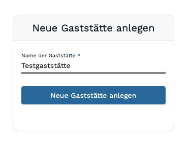

# Erste Schritte

In Diesem Guide erfahren Sie, wie Sie einfach & unkompliziert einen Account im Servire-Desk erstellen, eine Gaststätte anlegen und mit dem Demo-Datenbestand umgehen.

## Servire Desk-Account erstellen
Besuchen Sie zunächst das Online-Portal des Servire Desk unter [desk.servire.de](https://desk.servire.de). Wählen Sie dort zunächst die Option `Registrieren` und geben nun Ihre persönlichen Informationen an.

## Neue Gaststätte anlegen
Nach der erfolgreichen Registrierung eines neuen Accounts im Servire Desk können Sie Ihre Gastsätte anlegen!

:::tip Übrigens:
Servire unterstützt unabhängig von Lizenzen mehrere Gaststätten! So können Sie sowohl eine Demo-/Testgaststätte zu Schulungs- und Testzwecken, als auch eine Livegaststätte, die zum aktiven Betrieb verwendet wird, anlegen. Dabei bleiben dann Testdaten von realen Umsätzen getrennt.
:::
Nach einem Klick auf den dazugehörigen Button auf dem Wilkommensbildschirm geben Sie einen Namen für die Gaststätte an und klicken auf `Neue Gaststätte anlegen`.

Nun werden Testdaten importiert und Ihre Gaststätte angelegt.
Ist der Import erfolgreich, wird Ihnen der Servire Desk angezeigt und Servire ist betriebsbereit. Um erste Daten aufzuzeichnen, fahren Sie mit dem nächsten Schritt in der App fort!

## Einrichten der iOS-App
:::caution Wichtig
Derzeit ist die mobile Servire-App **nur auf Apple-Geräten mit einer Softwareversion ab iOS 15** verfügbar. Unterstützung für Android-Geräte folgt.
:::
Laden Sie die Servire-App durch einen Klick auf die folgende Grafik kostenfrei im AppStore herunter:

Nachdem Sie die App heruntergeladen haben, loggen Sie sich mit den von Ihnen zuvor vergebenen Anmeldedaten in der App ein.
Im nach dem Login angezeigten Sheet wird Ihnen eine Auswahl Ihrer Gaststätten (sofern Sie mehrere mit Ihrem Account verbunden haben) angezeigt und Sie können - sofern noch nicht geschehen - eine Schicht starten.
:::tip Übrigens:
Die Gaststättenauswahl wird auch dann relevant, wenn Sie teil mehrerer Gaststätten, ggf. auch als Arbeitnehmer sind. So können Sie neben einer eigenen (Test-)Gaststätte auch in anderen Gaststätten mitwirken!
:::

## Erste Schritte in der App
Nach Start der ersten Schicht wird Ihnen der Tischplan präsentiert.
Durch horizontales swipen über den Bildschirm können Sie zwischen Bereichen, wie z.B. dem Außen- oder Innenbereich wechseln.
:::tip Übrigens:
Blau hervorgehobene Tische enthalten bereits Bestellungen / Buchungen, andere Tische sind noch unbelegt.
:::

Wie Sie Ihre erste Bestellung annehmen, erfahren Sie in dem dazugehörigen Guide!